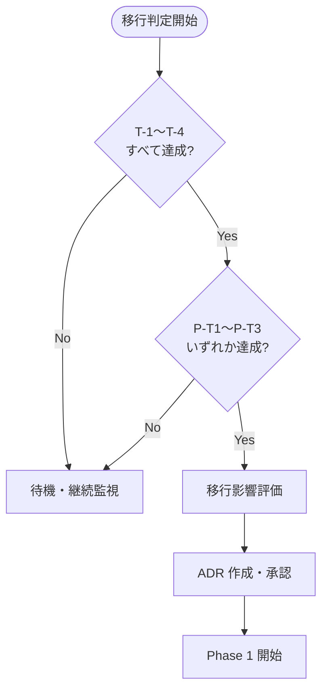
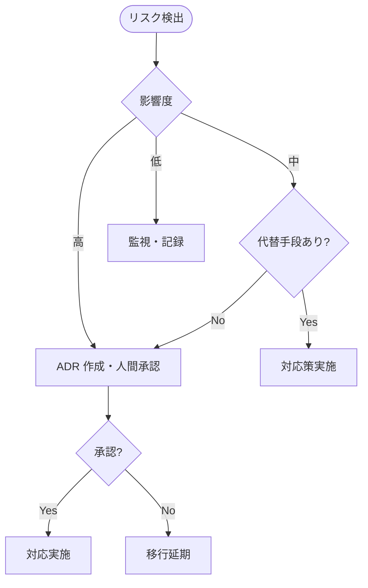

# A2A プロトコル移行ロードマップ

> 本ドキュメントは、現在の Copilot Extensions ベースのマルチエージェントシステムを
> Google A2A（Agent-to-Agent）プロトコル v0.3 に移行するための計画を記述する。
>
> **ステータス**: 設計段階（将来対応）
> **最終更新**: 2025-07
> **関連**: [orchestration.md](../orchestration.md), [architecture.md](../architecture.md)

---

## 目次

1. [現状と目標の差分分析](#1-現状と目標の差分分析)
2. [移行のトリガー条件](#2-移行のトリガー条件)
3. [段階的移行の手順案](#3-段階的移行の手順案)
4. [リスクと対応策](#4-リスクと対応策)

---

## 1. 現状と目標の差分分析

### 1.1 現在のアーキテクチャ（As-Is）

| 項目 | 現状 |
|---|---|
| 基盤 | GitHub Copilot Extensions（VS Code / CLI） |
| エージェント定義 | `.github/agents/*.agent.md`（Markdown） |
| 通信方式 | Copilot Chat 内の `runSubagent` ツール |
| ディスカバリ | 静的（agent.md ファイルの直接参照） |
| 認証 | GitHub Copilot セッションに依存 |
| データ形式 | 自然言語テキスト（非構造化） |
| 委譲パターン | sub-agent（双方向）+ handoff（一方向） |

### 1.2 目標アーキテクチャ（To-Be）

| 項目 | A2A v0.3 目標 |
|---|---|
| 基盤 | A2A プロトコル準拠の HTTP/gRPC サーバー |
| エージェント定義 | Agent Card JSON（`/.well-known/agent.json`） |
| 通信方式 | A2A タスク API（`tasks/send`, `tasks/sendSubscribe`） |
| ディスカバリ | 動的（Agent Card の HTTP エンドポイント公開） |
| 認証 | Bearer トークン / OAuth 2.0 |
| データ形式 | A2A Message / Part / Artifact（構造化） |
| 委譲パターン | sub-agent（双方向）+ handoff（一方向、制御移譲） |

### 1.3 差分マトリクス

| 差分項目 | ギャップ | 移行難易度 |
|---|---|---|
| エージェント定義フォーマット | Markdown → JSON Agent Card | 低（本タスクで設計済み） |
| 通信プロトコル | runSubagent → HTTP/gRPC Task API | **高** |
| ディスカバリ | 静的参照 → 動的エンドポイント | 中 |
| 認証 | Copilot セッション → Bearer/OAuth | 中 |
| データ構造 | 非構造化テキスト → Part/Artifact | 中 |
| ストリーミング | Copilot 依存 → SSE/gRPC stream | 中 |
| 委譲パターン | 共通（sub-agent / handoff 両対応） | 低 |

### 1.4 委譲パターンの区別: sub-agent と handoff

現在のシステムでは2つの委譲パターンを使い分けている。A2A 移行後もこの区別を維持する。

#### sub-agent（双方向委譲）

```
Orchestrator → サブエージェント → (結果返却) → Orchestrator
```

- **対象**: implementer, test-engineer, auditor-spec, auditor-security, auditor-reliability
- **特徴**: Orchestrator が呼び出し元として制御を保持し、サブエージェントの完了後に制御が戻る
- **A2A マッピング**: `tasks/send` または `tasks/sendSubscribe`（ストリーミング）の標準タスクフロー
- **Agent Card 表現**: `_meta.delegationMode: "sub-agent"`

#### handoff（一方向委譲・制御移譲）

```
Orchestrator → release-manager → (人間に直接報告)
```

- **対象**: release-manager のみ
- **特徴**: Orchestrator が制御ごと引き渡し、以降のフローは release-manager が主導する。制御は Orchestrator に戻らない
- **A2A マッピング**: A2A の `transfer` アクション（制御移譲）。タスク状態が `transferred` に遷移する
- **Agent Card 表現**: `_meta.delegationMode: "handoff"`, `_meta.delegationRole: "terminal"`

#### マッピング対照表

| 現在の概念 | A2A v0.3 対応 | 備考 |
|---|---|---|
| `runSubagent`（結果返却あり） | `tasks/send` + `completed` 状態 | 5エージェントに適用 |
| handoff（制御移譲） | `tasks/send` + `transfer` アクション | release-manager のみ |
| Orchestrator hub | Agent Card の `_meta.delegationRole: "hub"` | ディスカバリで判別可能 |
| spoke agent | Agent Card の `_meta.delegationRole: "spoke"` | ユーザー直接呼出不可 |

---

## 2. 移行のトリガー条件

以下の **すべて** の条件が満たされた場合に移行を開始する。一部のみ達成の状態では移行しない。

### 2.1 技術的トリガー

| # | 条件 | 判定基準 | 現状 |
|---|---|---|---|
| T-1 | A2A プロトコルの安定版リリース | v1.0 GA または主要クラウドプロバイダー※の本番採用、または OSS 代替トリガー※※の達成 | v0.3（未達） |
| T-2 | Python A2A SDK の成熟 | `a2a-python` SDK が安定版に到達 | 開発中（未達） |
| T-3 | gRPC サポートの安定化 | v0.3 で追加された gRPC transport が本番利用可能 | 実験的（未達） |
| T-4 | Agent Card 署名の標準化 | 署名検証ツールチェーンが整備 | 仕様策定中（未達） |

> ※「主要クラウドプロバイダー」= AWS・Google Cloud・Azure のうち **2社以上** が A2A エージェントのマネージドサービスを本番提供していること。
>
> ※※ OSS 代替トリガー: プロジェクトが自律的に判断できる代替条件として、以下の **すべて** を満たす場合も T-1 を達成したものとみなす:
> 1. A2A 互換の OSS 実装が Apache-2.0 など本プロジェクトで許容されたライセンスで公開されていること
> 2. 当プロジェクトで PoC と負荷試験を実施し、要求される性能・信頼性・セキュリティ要件を満たすことを確認済みであること
> 3. 当該 OSS 実装を前提とした運用手順と監視項目が `docs/runbook.md` に反映済みであること

### 2.2 プロジェクト的トリガー

| # | 条件 | 判定基準 | 現状 |
|---|---|---|---|
| P-T1 | 複数ホスト間のエージェント分散の必要性 | 単一マシンでの処理能力が不足 | 不要（未達） |
| P-T2 | 外部エージェントとの連携要件 | サードパーティ AI エージェントとの相互運用が必要 | なし（未達） |
| P-T3 | Copilot Extensions の制約がボトルネック化 | 現行基盤で実現不可能な機能要件が発生 | 非該当（未達） |

### 2.3 判定フロー



---

## 3. 段階的移行の手順案

### 3.1 移行フェーズ概要

| Phase | 名称 | 期間目安 | 内容 |
|---|---|---|---|
| Phase 0 | 設計・準備 | 現在 | Agent Card JSON 設計、ロードマップ策定 |
| Phase 1 | デュアルスタック | 2〜4週間 | Agent Card 公開 + 既存 Copilot 連携を維持 |
| Phase 2 | A2A タスク API 導入 | 4〜6週間 | HTTP タスク API 実装、段階的切替 |
| Phase 3 | 完全移行 | 2〜4週間 | Copilot Extensions 依存の除去、gRPC 対応 |

### 3.2 Phase 0: 設計・準備（現在）

**目標**: A2A 移行に必要な設計成果物を作成する。コードの変更は行わない。

| タスク | 成果物 | 状態 |
|---|---|---|
| 全7エージェントの Agent Card JSON 作成 | `docs/a2a-design/*.agent.json` | ✅ 完了 |
| 移行ロードマップ策定 | `docs/a2a-design/migration-roadmap.md`（本文書） | ✅ 完了 |
| 委譲パターン（sub-agent / handoff）の整理 | 本文書 §1.4 | ✅ 完了 |

### 3.3 Phase 1: デュアルスタック

**目標**: A2A Agent Card を公開しつつ、既存の Copilot 連携を維持する。

```
既存: runSubagent (Copilot) ──→ エージェント
新規: /.well-known/agent.json ──→ Agent Card 公開（通信はまだ Copilot 経由）
```

| ステップ | 作業内容 | 前提条件 |
|---|---|---|
| 1-1 | 各エージェントに HTTP サーバー（FastAPI / aiohttp）を追加 | Python 環境整備 |
| 1-2 | `/.well-known/agent.json` エンドポイントの公開 | Phase 0 の Agent Card 設計 |
| 1-3 | Agent Card 自動テスト（スキーマバリデーション） | A2A JSON Schema 公開 |
| 1-4 | ディスカバリ動作確認（外部クライアントから Agent Card 取得） | 1-2 完了 |

**リスク**: localhost 制約（P-001 相当の禁止操作がある場合）との整合性。0.0.0.0 バインド禁止。

### 3.4 Phase 2: A2A タスク API 導入

**目標**: A2A タスク API（`tasks/send`, `tasks/sendSubscribe`）を実装し、段階的にトラフィックを切り替える。

| ステップ | 作業内容 | 前提条件 |
|---|---|---|
| 2-1 | A2A Python SDK（`a2a-python`）の導入 | SDK 安定版リリース |
| 2-2 | Orchestrator に A2A クライアント実装 | 2-1 完了 |
| 2-3 | 各 spoke エージェントに A2A サーバー実装 | 2-1 完了 |
| 2-4 | sub-agent パターンの A2A 化 | 2-2, 2-3 完了 |
| 2-5 | handoff パターンの A2A 化（`transfer` アクション） | 2-4 完了 |
| 2-6 | ストリーミング対応（SSE → `tasks/sendSubscribe`） | 2-4 完了 |
| 2-7 | 認証実装（Bearer トークン検証） | セキュリティ設計 |
| 2-8 | A2A エージェント環境での Serena MCP 連携動作確認 | 2-4 完了, MCP 互換性確認 |

**切替戦略**: カナリアデプロイ方式。1エージェントずつ切り替え、問題がなければ次へ。

```
切替順序:
  1. auditor-spec（最もシンプル、読み取り専用）
  2. auditor-security（読み取り専用）
  3. auditor-reliability（Serena 連携あり、検証が必要）
  4. test-engineer（ファイル編集あり）
  5. implementer（Serena + ファイル編集、最も複雑）
  6. release-manager（handoff パターン、最後に切替）
```

### 3.5 Phase 3: 完全移行

**目標**: Copilot Extensions 依存を除去し、A2A プロトコルに完全移行する。

| ステップ | 作業内容 | 前提条件 |
|---|---|---|
| 3-1 | `runSubagent` 呼び出しの除去 | Phase 2 全エージェント切替完了 |
| 3-2 | `.github/agents/*.agent.md` のアーカイブ | 3-1 完了 |
| 3-3 | gRPC transport の導入（オプション） | gRPC サポート安定化 |
| 3-4 | Agent Card 署名の導入 | 署名ツールチェーン整備 |
| 3-5 | E2E テスト（全パイプラインの A2A 経由動作確認） | 3-1 完了 |
| 3-6 | ドキュメント更新（orchestration.md, architecture.md） | 3-5 完了 |

---

## 4. リスクと対応策

### 4.1 リスク一覧

| # | リスク | 影響度 | 発生確率 | 対応策 |
|---|---|---|---|---|
| R-1 | A2A プロトコルの破壊的変更 | 高 | 中 | Phase 0 の Agent Card を抽象層で設計し、プロトコル変更の影響を局所化する |
| R-2 | Copilot Extensions の突然の廃止 | 高 | 低 | Phase 1 を前倒しで準備し、デュアルスタック状態を確保する |
| R-3 | A2A Python SDK の品質不足 | 中 | 中 | SDK に依存しない薄いラッパー層を設け、直接 HTTP 実装にフォールバック可能にする |
| R-4 | Serena MCP と A2A の互換性問題 | 中 | 中 | MCP は A2A とは独立したプロトコル。Phase 2-8 で互換性を個別検証する |
| R-5 | handoff パターンの A2A 未サポート | 中 | 低 | A2A v0.3 における `transfer`（handoff 相当）アクションのサポート状況は公式ドキュメントおよび実装で要確認。未サポートまたは未実装の場合は擬似 handoff（sub-agent + 制御フラグ）で代替する |
| R-6 | 認証・セキュリティの複雑化 | 中 | 中 | localhost 制約（P-001 相当）を維持。外部公開は ADR で別途判断する |
| R-7 | 移行期間中の機能劣化 | 低 | 中 | デュアルスタック方式により、A2A 側に問題があれば即座に Copilot 側にフォールバック |

### 4.2 リスク対応の判断フロー



### 4.3 ロールバック計画

Phase 1〜3 の各ステップで問題が発生した場合のロールバック手順：

| Phase | ロールバック手順 | 所要時間 |
|---|---|---|
| Phase 1 | Agent Card エンドポイントを停止するだけで OK。既存 Copilot 連携に影響なし | 即時 |
| Phase 2 | 切替済みエージェントを Copilot 経由に戻す。カナリアデプロイのため影響は1エージェントに限定 | 数分 |
| Phase 3 | Phase 2 の状態に戻す。`.agent.md` をアーカイブから復元 | 数十分 |

---

## 付録 A: Agent Card ファイル一覧

| ファイル | エージェント | ユーザー呼出 | 委譲モード |
|---|---|---|---|
| `orchestrator.agent.json` | Orchestrator | ✅ | hub |
| `implementer.agent.json` | implementer | ❌ | sub-agent (spoke) |
| `test-engineer.agent.json` | test-engineer | ❌ | sub-agent (spoke) |
| `auditor-spec.agent.json` | auditor-spec | ❌ | sub-agent (spoke) |
| `auditor-security.agent.json` | auditor-security | ❌ | sub-agent (spoke) |
| `auditor-reliability.agent.json` | auditor-reliability | ❌ | sub-agent (spoke) |
| `release-manager.agent.json` | release-manager | ❌ | handoff (terminal) |

## 付録 B: 用語集

| 用語 | 定義 |
|---|---|
| A2A | Agent-to-Agent protocol。Google が策定したエージェント間通信プロトコル |
| ACP | Agent Communication Protocol。A2A に統合された（2025-09） |
| Agent Card | エージェントの能力・スキル・認証を記述する JSON メタデータ |
| sub-agent | Orchestrator が呼び出し、結果を受け取る双方向委譲パターン |
| handoff | Orchestrator が制御ごと引き渡す一方向委譲パターン |
| hub | ハブ&スポーク構成の中心ノード（Orchestrator） |
| spoke | ハブ&スポーク構成の末端ノード（各専門エージェント） |
| Shift-Left | 品質保証活動をパイプラインの早期段階に移動する設計原則 |
| Bounded Recursion | 修正ループに最大回数（3回）を設ける安全設計 |
| MCP | Model Context Protocol。AI モデルが外部ツールにアクセスするためのプロトコル |

## 付録 C: 変更履歴

| 日付 | 変更内容 |
|---|---|
| 2025-07 | 初版作成（Phase 0 成果物） |
